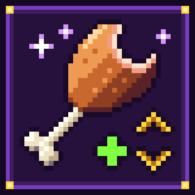

<p align="center">
  
</p>

<h1 align="center">Munchaholic</h1>

<p align="center"><em>Take a bite. Roll a stat. Never stop.</em></p>

Munchaholic is a Minecraft mode in which each food you finish eating permanently buffs or debuffs one of your player
attributes: size, gravity, jump, speed, max health, reach and more. The changes keep stacking, up to a safety cap.

It's a Fabric mod for Minecraft Java 26.2–26.3 (in [`fabric/`](fabric/), see [fabric/README.md](fabric/README.md)).
There is no Bedrock version.

## What it does

When the mode is on, each food a player finishes eating does the following:

1. **Skipped cases:** players in Creative or Spectator, and fake players from other mods (auto-feeders and similar).
   Potions, milk and ominous bottles aren't food, so they never count.
2. **Food:** any food counts, including every slice of cake (a candle cake too) and foods from other mods and
   datapacks. The last item of a stack counts like any other.
3. **Attribute:** in [Random mode](#roll-mode) (the default), one of the [20 attributes](#attributes-and-safety-caps)
   at random, going up or down with a 50/50 chance. In [Recipes mode](#roll-mode), each food always changes the same
   attribute in the same direction in this world.
4. **Change:** the attribute moves one step, for example Scale -8% or Max Health +2. Steps add up, so eating twice
   gives twice the change, and an up and a down cancel out. If the step would pass the attribute's
   [safety cap](#attributes-and-safety-caps), Random mode rolls a different attribute instead, and Recipes mode
   changes nothing.
5. **Feedback:** the actionbar shows the food, the change and the new value, for example
   `✦ Carrot → Scale -8% (now 92%)`. The change is green for a buff and red for a debuff. Each player can turn off
   the sound, the message, or both (see [Notification settings](#notification-settings)).

Changes are permanent. They stay when you log out and, by default, when you die. Difficulty and hardcore settings are
never changed.

## At a glance

| | Munchaholic (Fabric) |
|---|---|
| Game versions | Minecraft Java 26.2–26.3 (one jar for both) |
| Requirements | Fabric Loader 0.19.5+, Fabric API, Java 25. Mod Menu optional |
| Turning it on | **Munchaholic Mode** ON/OFF button on the Create World → Game tab, right under Difficulty (saved with the world), or `/munchaholic on` |
| Default | On for new worlds (Create World button); off for worlds made without it, e.g. dedicated servers |
| Toggling later | `/munchaholic [on\|off\|status]`, operators only (permission level 2, like /gamerule) |
| Roll Mode | **Roll Mode** button under Munchaholic Mode (**Random** by default, or **Recipes**), or `/munchaholic mode random\|recipes` (operators) |
| What triggers a roll | Finishing any food, or eating a slice of cake, in Survival or Adventure |
| What a roll changes | One of 20 vanilla player attributes, one step up or down |
| Limits | Every attribute has a safety cap (see [Attributes and safety caps](#attributes-and-safety-caps)) |
| On death | Changes are kept. `/munchaholic keep-on-death off` (operators) makes them die with you. Discovered recipes are always kept |
| Achievements | Unaffected |
| Languages | English and Russian |
| Notification settings (per player) | Mod Menu → Munchaholic → config screen, or the client command `/munchaholic-notify <sound\|message\|status> [on\|off]` (needs the mod on the client; saved in `config/munchaholic.json`) |

## Notification settings

Every roll shows an actionbar message and plays a quiet chime: a higher note for a buff, a lower one for a debuff.
Each player can turn off either one, or both.

With [Mod Menu](https://modrinth.com/mod/modmenu) installed, open Mods → Munchaholic → the config button, and switch
**Roll sound** / **Roll message**. Without Mod Menu, use the client command `/munchaholic-notify sound off`,
`/munchaholic-notify message off`, or `/munchaholic-notify status`. Settings are stored on your computer in
`config/munchaholic.json` and apply on any server that runs Munchaholic. Players who join without the mod on their
client always get the default message and sound.

## Roll Mode

Every world has a **Roll Mode** that decides what a food does. It's **Random** by default.

**Switching it** (saved per world)
- Create World → *Game* tab → **Roll Mode: Random** / **Recipes** (under *Munchaholic Mode*; the button is grayed out
  while Munchaholic Mode is OFF), or as an operator: `/munchaholic mode random|recipes` (plain `/munchaholic mode`
  shows the current one, and anyone can run it).

**Random:** every bite rolls any of the 20 attributes, up or down. Two carrots in a row can do completely different
things.

**Recipes:** each food has one fixed effect in this world, for example "carrot: Speed up" or "bread: Gravity down".
The effects come from the world seed, so another world has different recipes. They're hidden until you eat the food.
From then on, the food's tooltip shows its effect, for example `Munchaholic: Speed ▲` (green arrow for a buff, red for
a debuff). Foods you haven't eaten yet show `Munchaholic: ??? (eat it to find out)`. Plain and candle cake are one food.
Tooltips appear only while the mode is on and set to Recipes, and they need the mod on the client.

In Recipes mode, a food whose effect is at its cap does nothing. The bite still counts, the actionbar says so in gray,
for example `✦ Carrot → Scale -8% (at the limit: 20%)`, and you can eat other foods to move that attribute back.

Switching the Roll Mode keeps every change you already have. Discovered recipes are kept too, and show up again when
you switch back to Recipes.

## Attributes and safety caps

A roll moves one of these vanilla player attributes by one step. Percentages are relative to the normal value, so
100% means unchanged. For most attributes a higher value is the buff. For Gravity, Fall Damage Multiplier and Burning
Time a **lower** value is the buff, so `Gravity -10%` shows in green.

| Attribute | Per bite | Normal | Range | Buff is |
|---|---|---|---|---|
| Scale | 8% | 100% | 20% – 596% | higher |
| Gravity | 10% | 100% | 20% – 300% | lower |
| Jump Strength | 10% | 100% | 50% – 300% | higher |
| Step Height | 0.2 blocks | 0.6 | 0.2 – 2.6 | higher |
| Speed | 8% | 100% | 36% – 300% | higher |
| Sneaking Speed | 10% | 100% | 50% – 330% | higher |
| Attack Damage | 0.5 | 1 | 0.5 – 10 | higher |
| Attack Speed | 10% | 100% | 40% – 310% | higher |
| Max Health | 2 (1 heart) | 20 | 2 – 60 (1 – 30 hearts) | higher |
| Armor | 1 | 0 | 0 – 20 | higher |
| Knockback Resistance | 10% | 0% | -50% – 100% | higher |
| Safe Fall Distance | 1 block | 3 | 1 – 23 | higher |
| Fall Damage Multiplier | 10% | 100% | 10% – 300% | lower |
| Block Interaction Range | 10% | 100% (4.5 blocks) | 30% – 300% (1.35 – 13.5 blocks) | higher |
| Entity Interaction Range | 10% | 100% (3 blocks) | 40% – 300% (1.2 – 9 blocks) | higher |
| Mining Efficiency | 2 | 0 | 0 – 40 | higher |
| Oxygen Bonus | 1 | 0 | 0 – 20 | higher |
| Water Movement Efficiency | 10% | 0% | 0% – 100% | higher |
| Burning Time | 10% | 100% | 10% – 300% | lower |
| Luck | 1 | 0 | -10 – 10 | higher |

Caps are counted on the attribute's base value plus Munchaholic's own change only. Armor you wear, potion effects and
other mods don't count, so a full set of diamond armor never blocks an Armor roll, and a Speed potion still works on
top of the cap. When a step would pass a cap, Random mode rolls a different attribute instead (with a new direction),
and Recipes mode does nothing and shows the "at the limit" message.

The caps keep every player playable: you never shrink below 20% or lose your last heart, gravity never reaches zero,
and you can always reach at least 1.2 blocks.

**Fair play:** Creative and Spectator players never roll. Fake players from other mods (auto-feeders and similar) never
roll either. Every change is one vanilla attribute modifier, `munchaholic:bites`, which you can inspect with
`/attribute @s minecraft:scale modifier value get munchaholic:bites`.

## Commands

| Command | Who | What it does |
|---|---|---|
| `/munchaholic` or `/munchaholic status` | everyone | Shows whether Munchaholic Mode is on, the Roll Mode and the keep-on-death setting |
| `/munchaholic on\|off` | operators | Turns Munchaholic Mode on or off for this world. OFF stops new rolls and keeps existing changes |
| `/munchaholic mode` | everyone | Shows the Roll Mode |
| `/munchaholic mode random\|recipes` | operators | Sets the Roll Mode for this world |
| `/munchaholic keep-on-death` | everyone | Shows whether changes are kept on death |
| `/munchaholic keep-on-death on\|off` | operators | Keeps changes on death (the default), or makes them die with the player |
| `/munchaholic stats` | everyone | Lists your bites eaten, recipes discovered and every changed attribute with its current value |
| `/munchaholic stats <player>` | operators | The same for another player |
| `/munchaholic reset <targets>` | operators | Removes all attribute changes and the bite count of the targets. Discovered recipes are kept |
| `/munchaholic reset <targets> recipes` | operators | Makes the targets forget their discovered recipes. Attribute changes are kept |

"Operators" means permission level 2, like /gamerule. In single-player that needs cheats: Allow Commands on, or Open
to LAN with Allow Cheats on. Setting changes and resets are announced to other operators, like game rule changes.

**On death:** with keep-on-death on, you respawn with all your changes and full health (including any extra hearts).
With it off, the changes die with you and a chat line tells you so. Discovered recipes survive death either way.
Leaving the End keeps everything.

## Install

1. Install [Fabric Loader](https://fabricmc.net/use/) for Minecraft 26.2 or 26.3, and run the game on Java 25.
2. Put [Fabric API](https://modrinth.com/mod/fabric-api) and `munchaholic-<version>.jar` in your `mods/` folder. Get
   the jar from [GitHub releases](https://github.com/nezo32/munchaholic/releases) or CurseForge.
   Optional: [Mod Menu](https://modrinth.com/mod/modmenu) for the settings screen.
3. Turn the mode on in one of two ways:
   - **New world:** Create World → Game tab → **Munchaholic Mode** is **ON** by default (switch it off there for a
     normal world). Pick the **Roll Mode** on the button below it.
   - **Existing world or dedicated server:** an operator runs `/munchaholic on` (`/munchaholic status` shows the
     current state). Worlds made without the button (dedicated servers, other launchers) start with it off. In
     single-player this needs cheats: Allow Commands on, or Open to LAN with Allow Cheats on.
4. Optional: switch to [Recipes](#roll-mode) with `/munchaholic mode recipes`, or make changes die with the player
   with `/munchaholic keep-on-death off`.

Install the mod on the server and on every client. A server-only install still works: players without the mod get
the rolls and a vanilla actionbar message and sound, but no notification settings and no recipe tooltips.

## Known quirks

Munchaholic only changes vanilla player attributes. What those attributes do is up to vanilla. Some examples:

- A big player doesn't fit through doors, 1-block tunnels or under low ceilings, and can take suffocation damage when
  their head ends up inside a block. A tiny player fits through gaps a normal player can't.
- With Step Height above 1, you walk up full blocks without jumping. Above 1.5, you step right over fences and walls,
  so fenced pens no longer hold you.
- High Jump Strength can throw you high enough to take fall damage on landing, unless Safe Fall Distance or Fall
  Damage Multiplier make up for it. Low Gravity makes every jump float.
- Low Block Interaction Range means standing right next to a block to break or place it. High Entity Interaction Range
  lets you hit mobs from across a room.
- Losing Max Health removes the hearts at once. Gaining it doesn't heal: the new hearts start empty.
- Vanilla doesn't send Attack Damage or Knockback Resistance to the client, so client-side mods that show attributes
  see the normal values. `/munchaholic stats` shows the real ones.
- Mining Efficiency only helps with a tool that suits the block, like the Efficiency enchantment. Luck only changes
  some loot, such as fishing and chests.
- Turning Munchaholic Mode OFF freezes your changes: it stops new rolls but doesn't remove anything. Use
  `/munchaholic reset <player>` for that.
- With keep-on-death off, dying wipes every change and the bite count, but you remember the recipes you discovered.
- Removing the modifier with `/attribute … modifier remove munchaholic:bites` only lasts until the next join, when
  Munchaholic puts it back. Removing the mod doesn't undo the changes either, because the modifiers are saved with the
  player: run `/munchaholic reset <player>` first.
- Dedicated servers, and worlds made without the Create World button, start with the mode OFF until an operator runs
  `/munchaholic on`.
- Recipes come from the world seed, so two worlds with the same seed have the same recipes.

## Repository layout

| Path | Contents |
|---|---|
| `fabric/` | Fabric mod (Gradle) |
| `.github/workflows/` | CI (`ci.yml`), release (`release.yml`) and the reusable `reusable-*.yml` workflows |
| `scripts/` | CurseForge upload script and its tests |
| `docs/ci/` | Release runbook and reusable pipeline docs |
| `docs/branding/` | Logo, CurseForge page text, palette, player-facing strings |

## Development

The mod needs JDK 25. Gradle can also run on Java 21 and download a JDK 25 toolchain.

```bash
cd fabric
./gradlew build                   # Minecraft 26.3: compile, JUnit, server GameTests; jars in build/libs/
./gradlew clean build -Pmc=26.2   # the same against 26.2
```

One jar runs on both 26.2 and 26.3. The Create World buttons, the notification settings and the recipe tooltips are
covered by client GameTests (`./gradlew runClientGameTest`). They need a display (for example Xvfb), so `build` and CI
don't run them.

Branch names, PR rules and the full list of local checks are in [CONTRIBUTING.md](CONTRIBUTING.md).

## Releasing

To release, push an annotated `vX.Y.Z` tag on a commit of `main` (pre-releases use `-alpha.N`, `-beta.N` or `-rc.N`).
`release.yml` then does the rest:

1. Builds and tests the jar, stamping the tag's version into it.
2. Creates the GitHub release with notes generated from PR titles and labels, and attaches the jar and its sources jar.
3. Uploads the jar to CurseForge.

Don't edit the version in `fabric/gradle.properties` by hand. The tag sets the version.

The CurseForge upload needs the secret `CURSEFORGE_TOKEN` and the variable `CURSEFORGE_PROJECT_ID` (without it, the
CurseForge step is skipped). The optional variables `CURSEFORGE_GAME_VERSIONS` and `CURSEFORGE_ENVIRONMENT` override
the game versions and the GitHub Environment the upload runs in.

- Maintainer runbook: [docs/ci/RELEASING.md](docs/ci/RELEASING.md)
- How the reusable pipeline works and how other projects can use it:
  [docs/ci/REUSABLE_RELEASE_PIPELINE.md](docs/ci/REUSABLE_RELEASE_PIPELINE.md)

## License

[MIT](LICENSE) © 2026 nezo
